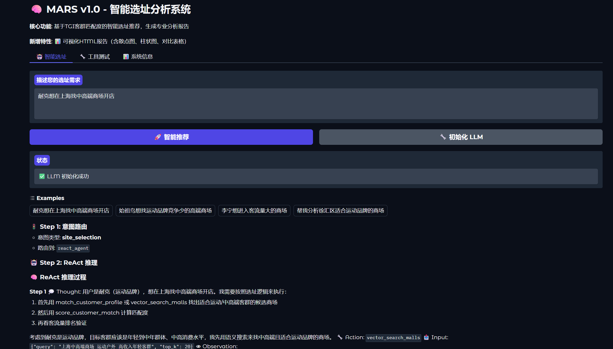
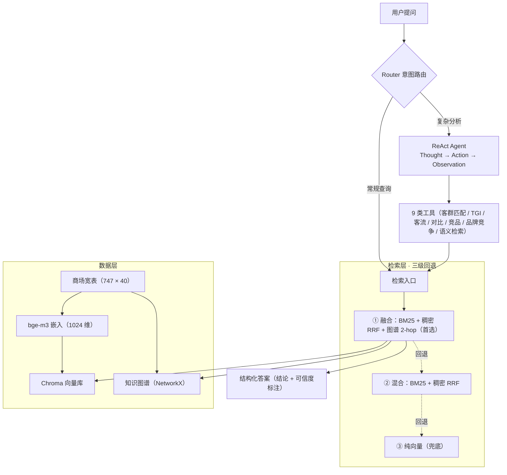

# MARS 智能选址系统（上海商场 RAG）

MARS（Multi-source Agent Reasoning for Site-selection）—— 商场选址检索问答系统。核心是「商场宽表 → 嵌入 → Chroma 向量库 → 多查询混合检索 → ReAct 多工具推理」。

## Demo



> 自然语言提问 → Router 意图分流 → ReAct 多轮工具调用 → 结构化答案 + 数据溯源。

## 系统架构



Router 按任务复杂度分流：复杂分析走 ReAct 循环调用 9 类工具，常规查询直接检索；检索层优先「BM25 + 稠密 RRF + 图谱 2-hop」三级融合，失败逐级回退。

## 目录结构

```
mars-site-selection/
  rag_utils.py                            公共模块：嵌入模型加载 + 查询拆分 + 混合检索
  create_vectordb_v6.py                   生成向量库
  generate_sample_data.py                 生成 20 家虚构商场的合成样例宽表
  sample_data.csv                         合成样例（40 列，与真实宽表同构，开箱跑通演示）
  download_model.py                       下载嵌入模型到本地（绕过 HF Hub HEAD 请求）
  fix_brand_merge.py                      重算品牌列（去重品牌数 / top50 / 垃圾词黑名单）
  clean_brand_preview.py                  品牌名清洗预览（只读，不改数据）
  mars_hybrid_retrieval.py                BM25 + 稠密混合检索（RRF 融合 + 可选 reranker）
  mars_graphrag.py                        知识图谱构建 + GraphRAG 检索器（hybrid+graph 融合）
  mars_eval_retrieval.py                  检索质量评估（Recall@k / MRR / nDCG@10）
  mars_eval_50.py                         50 条评测集构建（7 类查询）
  eval_compare.py / eval_final.py         检索对比评估（基线 vs 混合 vs 混合+Reranker）
  eval_graphrag_ab.py / eval_graphrag_fusion.py  三路/四路 A/B（基线/混合/GraphRAG/融合）
  mars_agent.py                       主 Agent（ReAct + 9 工具 + Gradio 界面）
  mars_api.py                             FastAPI 服务（RESTful + SSE 流式）
  requirements.txt                        核心依赖（Gradio + API 最小集）
  requirements-rag.txt                    可选 RAG / 向量库依赖
  .env.example                            环境变量示例（复制为 .env 填入 Key）
  run_gradio.bat / run_api.bat            Windows 一键启动

生成产物（均已 gitignore，需本地生成）：
  mall_wide_table_shanghai_final_v3.csv   宽表（747 商场 × 40 列，向量化唯一数据源）
  chroma_db/                              Chroma 向量库（bge-m3，1024 维）
  models/<repo>/                          本地下载的嵌入模型
```

## 数据链路

源数据来自一家商业地产数据服务方。

因数据授权限制，表名、原始文件与具体体量不公开，仓库中也不含任何原始数据。

最终宽表 `mall_wide_table_shanghai_final_v3.csv` = 上海商场宽表基础（747 家）+ 门店品牌聚合 + 客流 / 五维评分 / 客群画像 / 定位文本。

## ⚠️ 数据可复现性说明

**真实数据不随仓库分发。** 宽表 CSV、`chroma_db/`、`models/` 均因数据授权与体积原因未提交。

为让仓库开箱即跑通，提供一份 **20 家虚构商场的合成样例**（`sample_data.csv`，40 列与真实宽表同构），由 `generate_sample_data.py` 生成。合成样例的 `mall_name` / `mall_id` / `address` 均为虚构，品牌、品类、客群画像为通用公开词，仅用于演示检索效果。

**快速跑通演示（合成样例）：**

```bash
# 1. 安装依赖
pip install -r requirements.txt -r requirements-rag.txt

# 2. 下载嵌入模型到本地（约 2GB）
python download_model.py BAAI/bge-m3

# 3. 用合成样例作为宽表（真实宽表已 gitignore）
copy /Y sample_data.csv mall_wide_table_shanghai_final_v3.csv   # Windows；Linux/macOS 用 cp

# 4. 配置 API Key（不配也能启动，但只会进模拟模式，不产生真实推理）
copy .env.example .env      # Linux/macOS 用 cp，然后编辑 .env 填入 DEEPSEEK_API_KEY

# 5. 重建向量库
python create_vectordb_v6.py

# 6. 启动（二选一）
python mars_agent.py    # Web 界面 → http://127.0.0.1:7860
python mars_api.py          # FastAPI  → http://127.0.0.1:8000/docs
```

> Windows 用户若已建好 `.venv`，可直接双击 `run_gradio.bat` / `run_api.bat`，
> 它们会自动激活 `.venv` 并设好 UTF-8 编码。未建 `.venv` 请用上面的 python 命令。

**换真实数据**：把真实宽表放到 `mall_wide_table_shanghai_final_v3.csv`（列名见 `create_vectordb_v6.py` 的 `generate_embedding_text` 与元数据构造部分），重跑第 5 步即可。

## ⚠️ 已知数据缺口

**品牌门店数据只覆盖部分商场**，未覆盖的商场中包含一部分头部高端商场。

- 这是**源表覆盖缺口，不是合并 bug**：门店表的 `mall_id` 是宽表的干净子集（零错配）。
- 缺品牌的商场靠 `position_text`（区域消费力描述）+ 客群 TGI 标签兜底，因此「奢侈 / 高收入」类查询仍能正常召回高端标的。
- 要补齐需一张覆盖更全的门店表，现有数据源中不存在。

## ⚠️ 竞品分析定位（实验性辅助信息）

`CompetitorSearchAgent` 用 LLM 训练知识给出竞品「辅助信号」，**不属于核心事实链路**（LLM 不能当数据库）。模块会标注置信度、数据来源与「建议实地确认」；生产环境应接入实时品牌 / POI / 商业地产数据源。

## 重建向量库流程

> 面向持有真实源表数据的开发者（第 2 步 `fix_brand_merge.py` 需原始门店表）；仅演示请用上方「快速跑通」。

```bash
# 1. （首次/换模型时）下载嵌入模型到本地
python download_model.py BAAI/bge-m3

# 2. 重算品牌列（去重品牌数 + top50 品牌 + 垃圾词黑名单）
python fix_brand_merge.py

# 3. 重建向量库（约 9 分钟，CPU）
python create_vectordb_v6.py
```

模型与向量库维度必须一致（`rag_utils.EMBEDDING_MODEL` 默认 `BAAI/bge-m3`，1024 维）；换模型后必须重新跑第 3 步，否则维度不一致加载失败。

## 品牌字段口径（2026-09 修订）

`fix_brand_merge.py` 保证以下口径：

- `brand_count` = **去重品牌数**（同一品牌多铺位不重复计），不是门店行数。
- `top_brands` = 按门店出现次数取 **前 50** 个品牌名。
- 品类 `X_count`/`X_density` 保持「品类门店数 / 商场门店总行数」不变。
- 垃圾词黑名单（精确匹配）剔除「母婴室 / 休息区 / 服务台」等 223 条非品牌设施名。

注意：`brand_name` 字段本质是**门店名**（如「星巴克江桥万达店」），不是干净品牌名；约 94% 已是干净品牌，其余含「店」后缀/位置括号的噪声做完整清洗风险大于收益（会误伤「茶百道」「上海老饭店」），故只做了零风险的精确黑名单。

## 检索质量评估与混合检索（2026-09）

`mars_eval_retrieval.py` 用客观数据标注相关商场（非手拍），`mars_eval_50.py` 扩到 50 条（品牌实体 / 奢侈珠宝 / 运动 / 客流评分 / 客群定位 / 区县 / 组合，7 类），计算 Recall@k / MRR / nDCG@10。`mars_hybrid_retrieval.py` 提供 BM25 + 稠密向量混合检索（jieba 分词 + 稀有词门控 RRF 融合），`eval_compare.py` / `eval_final.py` 做对比。

50 条最终结果（`mars_eval_50.py`，每查询相关商场 4~45 个、中位 11）：

| 指标 | 基线（纯向量） | 混合（BM25+稠密） | 增量 |
|---|---|---|---|
| Recall@1 | 0.041 | 0.056 | +0.015 |
| Recall@3 | 0.097 | 0.144 | +0.047 |
| Recall@5 | 0.142 | 0.222 | +0.080 |
| Recall@10 | 0.238 | 0.338 | +0.100 |
| MRR | 0.635 | 0.694 | +0.059 |
| nDCG@10 | 0.375 | 0.505 | +0.130 |

按难度（Recall@5 / MRR，基线→混合）：

| 难度 | 条数 | R@5 | MRR |
|---|---|---|---|
| easy（品牌实体 / 区县） | 31 | 0.162→0.287 | 0.668→0.824 |
| medium（品类聚集 / 客群 / 档次） | 13 | 0.142→0.157 | 0.806→0.659 |
| hard（复合约束） | 6 | 0.035→0.028 | 0.096→0.093 |

结论：
- **混合检索整体净胜**：Recall@5 +56%、Recall@10 +42%、nDCG@10 +35%、MRR +9%。
- **品牌实体查询**（「有 X 的商场」，31 条）是最大赢家：BM25 词面精确命中品牌名，MRR 0.668→0.824、Recall@5 +77%。这正是「品牌拓店选址」的核心场景。
- **品类「聚集」类查询**（珠宝/运动聚集）MRR 略降：BM25 会高估「含单个品牌词」的商场，把聚合度更高的商场挤下去。
- **hard 复合约束**（品牌×档次、客群×客流）两种方法都低——词面+向量检索的天花板，需 query 分解或领域 reranker 才可能补上。
- **Reranker（bge-reranker-base）在本数据上不成立**：分数挤在 0.91~0.94 窄带、无区分度，不作为默认，保留 `search(reranker=...)` 可选参数。
- 平均单查询检索耗时 0.14s（慢在 ReAct 多轮 LLM 往返，非检索）。

## GraphRAG 融合（2026-09）

`mars_graphrag.py` 构建商场知识图谱（实体 Mall / District / Category / CustomerProfile，关系 LOCATED_IN / HAS_CATEGORY / TARGETS / SIMILAR_TO），`GraphRAGRetriever.hybrid_graph_search` 把图谱 2-hop 扩展作为第三路召回，并进 BM25+稠密的 RRF。

四路 A/B（`eval_graphrag_fusion.py`，50 条评测集）：

| 指标 | 混合（BM25+稠密） | GraphRAG | 融合（+图谱） |
|---|---|---|---|
| MRR | 0.694 | 0.652 | **0.744** |
| Recall@5 | 0.222 | 0.147 | **0.232** |
| nDCG@10 | 0.505 | 0.388 | **0.530** |

结论：
- **GraphRAG 单独用 ≈ 基线**：`_extract_entities` 是朴素关键词匹配（非 NER），品牌查询抽不出实体 → 图谱空转 → 退化成单向量。
- **融合才净胜**：图谱作为「多跳召回腿」补进 RRF，MRR 稳定 +0.05，且不拖累 easy。GraphRAG 不是取代 hybrid，是给它加一条腿。
- **reranker（bge-reranker-base）不成立**：分数挤在 0.91~0.94 窄带无区分度，未接入。
- **天花板**：品牌实体识别 + Brand 节点（`build_from_dataframe(df_brands=None)` 未建品牌边），品牌类查询（31/50）图谱空转，是 hard 复合约束拉不动的主因。
- **落地**：融合已接入 `mars_agent.py` 的 `_vector_search_malls`（惰性建图 + 融合→混合→纯向量三级回退）。

## 产品层 / 生成层 / 工具层评测（2026-09）

`mars_eval_product.py` 让**真实 Agent**（ReAct + 必需工具守卫）在 50 条评测集上端到端跑完，统计产品层指标（区别于上面的检索层）；`mars_eval_grounding.py` 读落盘的 trajectory，算生成层「数字溯源率」与工具层「召回/精确率」。三者都从 query 信息需求确定性推导，不引入 LLM-judge。

**产品层（n=50，两次独立干净跑，LLM 采样 ±2~4pt）：**

| 指标 | 数值 |
|---|---|
| 任务完成率（答案含 ≥1 可溯源 mall_id） | 100% |
| 一次解决率（未触发必需工具守卫） | 92–94% |
| 无效步数率 | 8.3–12.5% |
| 平均步数 | 6.88–6.98（上限 8） |
| 推荐精度 | ≈40%（39.6% / 41.8%） |
| 答案层 Recall@5 | 0.114–0.123（检索层 0.222） |

> **答案层 Recall@5 口径**：与检索层同一定义 `|命中的相关商场| / |该 query 相关商场总数|`——分母是 ground-truth（`relevant` 集），与检索层 `mars_eval_retrieval.py` 的标注完全同源，故 0.222 → 0.114–0.123 是同口径、可直接对比；分子来自最终答案抽取的 mall_id（推荐 3~5 个，Recall@5 被推荐数天然封顶）。两次独立干净跑该值为 0.114 / 0.123（LLM 采样抖动），表记区间、正文用 ≈0.12。

**生成层 / 工具层（单次跑 n=50）：**

| 指标 | 数值 |
|---|---|
| 数字溯源率（答案数字有工具返回同值来源） | 87.5%（按数字 n=957） |
| 工具召回率（必需工具类被调用） | 94%（47/50） |
| 工具精确率（非守卫调用纯净度） | 66% |

结论：
- **检索准 ≠ 答案准**：检索层 Recall@5 0.222 → 答案层 0.114–0.123、推荐精度 ≈0.4，损耗发生在「从候选池挑 Top3 + 给理由」这一步——护栏保证数字有出处（citation），不保证解读正确（grounding）。
- **可靠但不准**：任务完成率 100%，Agent 永远交得出带 mall_id、可溯源的答卷；问题不是「不可靠」，是「可靠地做出了不够准的选择」。
- **难度标签不预测表现，查询类型才预测**：有可计算硬约束（数值锚点）的查询稳定命中，纯语义（品牌实体 / 客群定位）稳定偏低，检索层与答案层证据指向同一结论。
- **数字溯源率 87.5% ≠ 幻觉率**：它量「数字有没有出处」，不量「解读对不对」；残余未溯源是自指计数 / 取整 / 客群假设，无凭空捏造的核心事实数字。
- **工具精确率 66%**：约 1/3 非守卫调用是探索性 / 非必需（品牌 query 混入客群匹配、评分 query 混入客流排名），是平均步数偏高的直接来源。

> ⚠️ 评测结果 JSON（含真实 mall_id）不随仓库分发，由 `*_result.json` 规则 gitignore；本表只保留聚合数。
